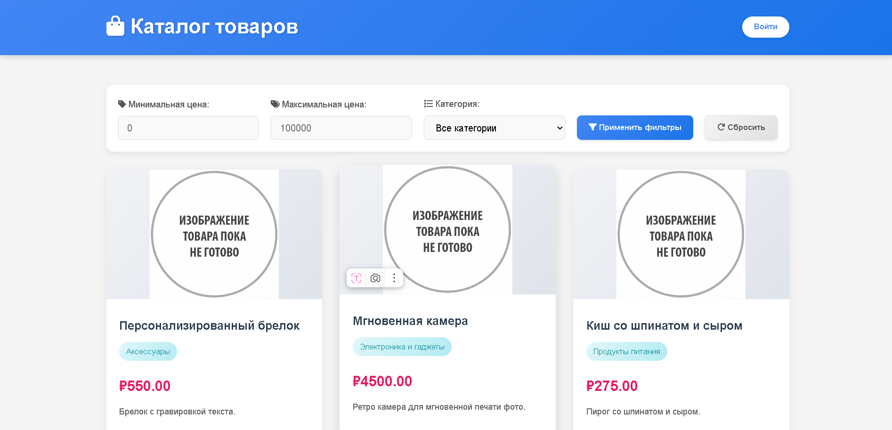
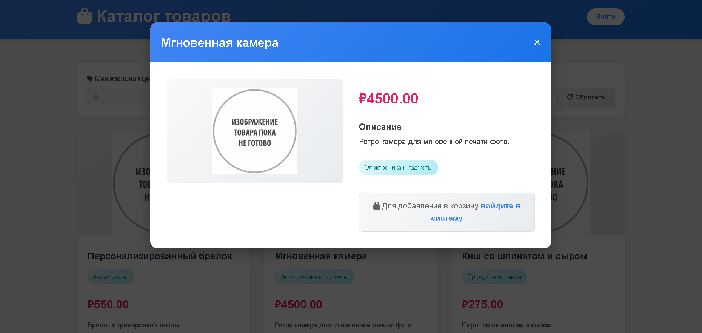
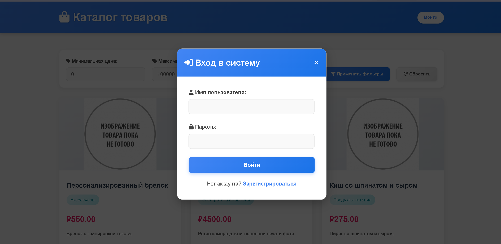
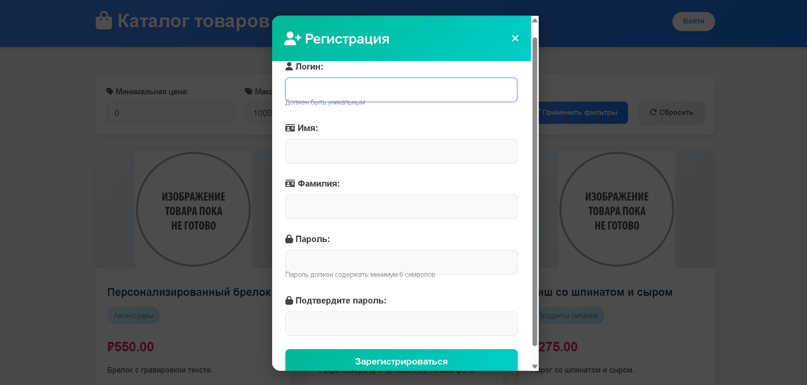
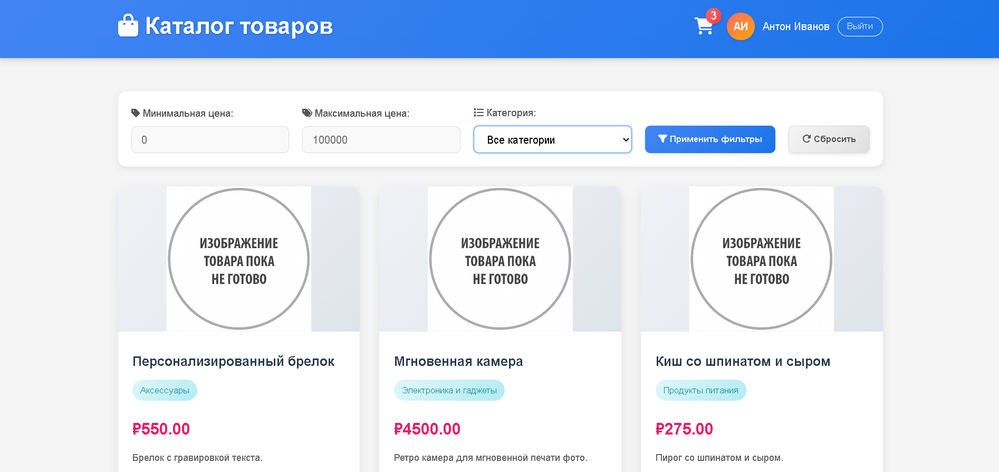
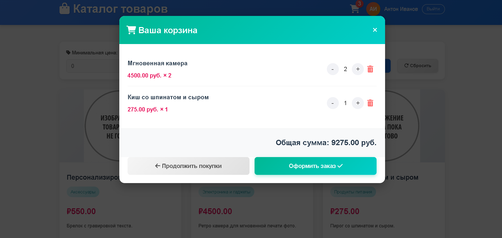

# 🛒 E-commerce Platform

**E-commerce Platform** — бэкенд для интернет-магазина на Java и Spring Boot с использованием современных практик разработки и контейнеризации.

---

## 🛠 Стек Технологий

### Основные технологии
*   **Язык:** Java 21
*   **Фреймворк:** Spring Boot 3.x, Spring Security
*   **Базы данных:** PostgreSQL
*   **ORM:** Spring Data JPA (Hibernate)
*   **Аутентификация:** JWT
*   **Межсервисная коммуникация:** REST API, Spring RestTemplate
*   **Кеширование:** Spring Cache, Caffeine
*   **Миграции БД:** Liquibase
*   **Контейнеризация:** Docker, Docker Compose
*   **API Документация:** OpenAPI 3 (Swagger UI)

### Тестирование

*   **JUnit 5, Mockito**
*   **Spring MVC Test**
*   **Testcontainers (интеграционное тестирование БД)**

### Сервисы
1. **Auth Service** - Регистрация, аутентификация, управление токенами
2. **User Service** - Управление пользовательскими профилями
3. **Product Service** - Управление товарами и категориями
4. **Cart Service** - Управление корзинами пользователей
5. **Page Service** - Статическая главная страница
   - **Важное примечание**:
     ```diff
      Фронтенд-реализация представлена в минимальном объеме и служит исключительно 
      для демонстрации взаимодействия с бэкенд-сервисами. Она не отражает уровень 
      владения фронтенд-технологиями и не является показателем соответствующих навыков.
      Основная цель проекта - демонстрация бэкенд-разработки на Java и Spring Boot.

---

## 🚀 Запуск проекта

### Предварительные требования
*   JDK 17+
*   Docker 20.10+
*   Docker Compose 2.4+
*   Maven 3.8+

### Локальный запуск через Docker Compose
1.  **Клонируйте репозиторий:**
    ```bash
    git clone https://github.com/Ant0nIvanov/e-commerce-platform.git
    cd e-commerce-platform
    ```

2. **Соберите проект:**
    ```bash
    mvn clean package -DskipTests
    ```

3. **Запустите все сервисы:**
    ```bash
    docker-compose up -d --build
    ```

     Эта команда:
      - Создаст общий контейнер PostgreSQL для всех сервисов
      - Запустит все микросервисы в отдельных контейнерах:
        * Auth Service
        * User Service
        * Product Service
        * Cart Service
        * Page Service
     - При первом запуске:
       * Будет создана общая БД
         - У каждого сервиса Spring Boot автоматически инициализирует Liquibase
         - Будет выполнен главный файл миграций: `db/changelog/db.changelog-master.xml`

4. **Остановка сервисов:**
    ```bash
    docker-compose down
    ```

5. **Сервисы будут доступны по адресам:**
    - Auth Service: `http://localhost:8080/api/v1/auth`
    - User Service: `http://localhost:8084/api/v1/users`
    - Product Service: `http://localhost:8081/api/v1/products`
    - Cart Service: `http://localhost:8083/api/v1/carts`
    - Page Service (Главная страница): `http://localhost:8181/e-commerce`**

[//]: # (   Swagger UI для каждого сервиса:)

[//]: # (    - `http://localhost:8080/swagger-ui.html`)

[//]: # (    - `http://localhost:8081/swagger-ui.html`)

[//]: # (    - `http://localhost:8083/swagger-ui.html`)

[//]: # (    - `http://localhost:8084/swagger-ui.html`)

## 📁 Структура репозитория
<pre>
e-commerce-platform/
├── auth-service/               # Сервис аутентификации
│   ├── src/
│   │   ├── main/
│   │   │   ├── java/ru/ivanov/authservice/
│   │   │   │   ├── client/
│   │   │   │   ├── config/    
│   │   │   │   ├── controller/
│   │   │   │   ├── dto/
│   │   │   │   ├── exception/
│   │   │   │   ├── mapper/
│   │   │   │   ├── model/
│   │   │   │   ├── repository/
│   │   │   │   ├── security/
│   │   │   │   ├── service/
│   │   │   │   ├── util/
│   │   │   │   └── AuthServiceApplication.java
│   │   │   └── resources/
│   │   │       └── application.yaml
│   ├── Dockerfile
│   └── pom.xml
│
├── cart-service/               # Сервис корзин
│   ├── src/
│   │   ├── main/
│   │   │   ├── java/ru/ivanov/cartservice/
│   │   │   │   ├── client/
│   │   │   │   ├── config/    
│   │   │   │   ├── controller/
│   │   │   │   ├── dto/
│   │   │   │   ├── exception/
│   │   │   │   ├── mapper/
│   │   │   │   ├── model/
│   │   │   │   ├── repository/
│   │   │   │   ├── security/
│   │   │   │   ├── service/
│   │   │   │   ├── util/
│   │   │   │   └── CartServiceApplication.java
│   │   │   └── resources/
│   │   │       ├── db/changelog/
│   │   │       └── application.yaml
│   ├── Dockerfile
│   └── pom.xml
│
├── page-service/               # Сервис статической страницы
│   ├── src/
│   │   ├── main/
│   │   │   ├── java/ru/ivanov/pageservice/
│   │   │   │   ├── config/    
│   │   │   │   ├── controller/
│   │   │   │   └── PageServiceApplication.java
│   │   │   └── resources/
│   │   │       ├── static/     # Статические файлы
│   │   │       │   ├── index.html
│   │   │       │   ├── css/
│   │   │       │   │   └── styles.css
│   │   │       │   └── js/
│   │   │       │       └── app.js
│   │   │       └── application.yaml
│   │   └── test/
│   ├── Dockerfile
│   └── pom.xml
│
├── product-service/            # Сервис продуктов
│   ├── src/
│   │   ├── main/
│   │   │   ├── java/ru/ivanov/productservice/
│   │   │   │   ├── config/    
│   │   │   │   ├── controller/
│   │   │   │   ├── dto/
│   │   │   │   ├── exception/
│   │   │   │   ├── mapper/
│   │   │   │   ├── model/
│   │   │   │   ├── repository/
│   │   │   │   ├── service/
│   │   │   │   ├── util/
│   │   │   │   └── ProductServiceApplication.java
│   │   │   └── resources/
│   │   │       ├── db/changelog/
│   │   │       └── application.yaml
│   │   └── test/
│   ├── Dockerfile
│   └── pom.xml
│
├── user-service/               # Сервис пользователей
│   ├── src/
│   │   ├── main/
│   │   │   ├── java/ru/ivanov/userservice/
│   │   │   │   ├── config/    
│   │   │   │   ├── controller/
│   │   │   │   ├── dto/
│   │   │   │   ├── exception/
│   │   │   │   ├── mapper/
│   │   │   │   ├── model/
│   │   │   │   ├── repository/
│   │   │   │   ├── security/
│   │   │   │   ├── service/
│   │   │   │   ├── utils/
│   │   │   │   └── UserServiceApplication.java
│   │   │   └── resources/
│   │   │       ├── db/changelog/
│   │   │       └── application.yml
│   │   └── test/
│   ├── Dockerfile
│   └── pom.xml
│
├── .gitattributes
├── .gitignore
├── README.md
├── docker-compose.yaml
├── mvnw
├── mvnw.cmd
└── pom.xml
</pre>

## Скриншоты

### Главная страница

### Профиль пользователя

### Окно входа

### Окно регистрации

### После входа в систему

### Корзина
